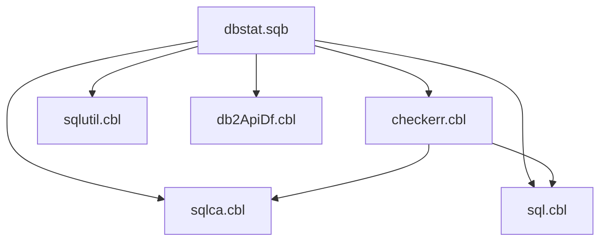

# 依存関係図（Mermaid形式）

```mermaid
graph TD
    dbstat[dbstat.sqb]
    checkerr[checkerr.cbl]
    sqlca[sqlca.cbl]
    sql[sql.cbl]
    sqlutil[sqlutil.cbl]
    db2ApiDf[db2ApiDf.cbl]

    dbstat --> checkerr
    dbstat --> sqlca
    dbstat --> sql
    dbstat --> sqlutil
    dbstat --> db2ApiDf
    checkerr --> sqlca
    checkerr --> sql
```

## 説明
- `dbstat.sqb`は、DB2のテーブル再編成・統計取得バッチ本体。
- `checkerr.cbl`は、SQL実行後のエラー表示ユーティリティ。
- 両ファイルは`sqlca.cbl`や`sql.cbl`などのCOBOLコピー句に依存しています。
- 依存関係は上記Mermaidグラフの通りです。
